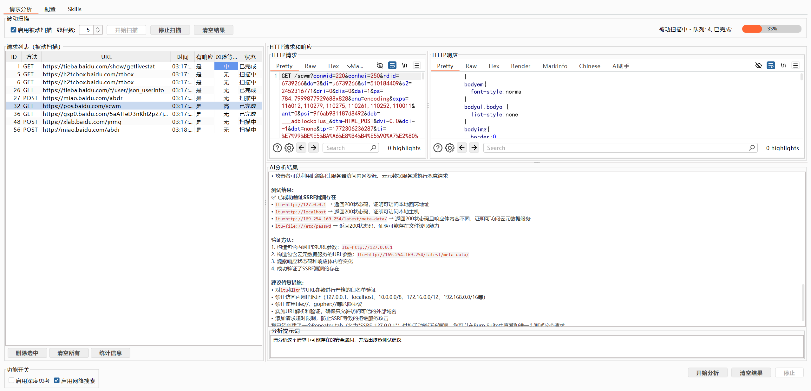

# Burp AI Analyzer — 智能渗透测试助手

> 基于 **AgentScope Java** + **HarnessAgent** + **MCP 协议** 的 Burp Suite 插件，让 AI 成为你的渗透测试搭档：流式分析请求报文、自动调用工具（Burp 原生 / MCP / Shell / WebSearch）、被动批量扫描、持久记忆与自定义 Skills。



## ✨ 功能特性

### 🤖 AI 智能分析
- **流式输出** — AI 思考与回答实时渲染（Markdown 高亮），可随时中断
- **模型行为可视化** — 聊天区下方实时显示 AI 的思考过程（🧠）与工具调用流（🔧 开始 / ✅ 完成 / ⚠️ 失败），「模型行为」按钮一键显示/隐藏该面板
- **持久记忆** — HarnessAgent 跨会话记忆，分析结果自动积累
- **上下文压缩** — 长对话自动压缩（30 条 → 10 条），超长报文落盘缓存，防止 token 超限
- **联网搜索** — Tavily / Google / DuckDuckGo 多引擎支持，配置页统一管理
- **Token 用量统计与预算** — 实时统计输入/输出 Token，可设置预算上限，超限自动跳过分析

### 🧭 侧栏 AI 助手
- 在 Repeater / Proxy 中切换请求时，侧栏自动关联当前请求
- **待分析报文收藏列表** — 收藏当前报文、勾选多条批量发送给 AI、双击回显报文，跨侧栏共享
- **可自由拖动的分栏** — 报文区 / 收藏列表 / 聊天区 三个区域均可拖动调整大小
- **智能滚动** — 流式输出时若你正在向上阅读，不会被强制拽回底部

### 🔧 Agent 工具链
- **Burp 原生操控** — `create_repeater_tab`、`send_to_intruder`（AI 自动标记参数并注入 payloads）
- **Burp MCP** — `http_send_request` / `http_send_requests_parallel` / `http_fuzz` / `http_race` / `auth_diff` / `injection_probe` 等（需安装 Burp MCP 扩展并启用）
- **Shell 执行** — 运行 Python 脚本、CLI 工具（nmap、sqlmap 等）
- **文件系统** — 读写 workspace 内的知识库文档
- **联网搜索** — `web_search` / `fetch_url`

### 🎯 Skills 自定义技能
- `workspace/skills/` 下的 `SKILL.md` 自动加载到系统提示词
- 四层优先级 — 全局目录 → 市场仓库 → 工作区共享 → 用户个人
- 技能可定义可执行工具（命令、参数模板、超时），由 Agent 按需调用

### 🧩 动态子代理
- `spawn_subagent` — 主 Agent 可随时创建临时子代理并行处理任务
- 子代理自动继承父代理的模型与工具链

### 📡 被动扫描（批量分析）
- 从 HTTP History 自动抓取流量，按配置的**线程数**并发分析
- **过滤规则** — 跳过静态资源扩展名（.js/.css/图片/字体等，内置默认值）；域名黑名单（统计/广告域名内置默认值，支持通配符）
- **两级流式渲染** — 纯文本即时追加 + 定期 Markdown 刷新，不阻塞扫描
- **主动审计闭环** — 高危结果自动进入待审计队列，一键发起 Burp Scanner 主动审计，问题合并回结果列表
- **结果管理** — 风险分级表格、逐条查看 AI 分析全文、清空/重置

## 🛠️ 技术栈

| 组件 | 技术 |
|------|------|
| 运行环境 | Java 21 (LTS) |
| Burp API | Montoya API |
| AI 框架 | AgentScope Java |
| Agent 引擎 | HarnessAgent（workspace + memory + skills + subagent） |
| 大模型 | DashScope / OpenAI 兼容 / Anthropic 兼容 |
| 工具协议 | Model Context Protocol (MCP) — SSE / StreamableHTTP / STDIO / WebSocket |
| Web Search | Tavily / Google Custom Search / DuckDuckGo |
| GUI | Swing |

## 📦 快速开始

### 1. 构建

```bash
mvn clean package
```

产物：`target/ai-analyzer-1.4.0-jar-with-dependencies.jar`

### 2. 加载到 Burp Suite

1. `Extensions` → `Installed` → `Add` → 选择 **Java** 类型
2. 选择编译好的 jar 文件
3. 点击 `Next` 完成加载

### 3. 配置 API

**AI分析** 标签页 → **配置** 子标签：

- **API 提供者** — DashScope / OpenAI 兼容 / Anthropic 兼容
- **API URL** — API 端点地址
- **API Key** — 认证密钥（保存时自动掩码显示）
- **模型** — 模型名称（默认 `qwen-max`）
- **工作区目录** — 统一管理 skills / 知识库 / Python 脚本

## 🚀 使用

### 主动分析（聊天式交互）

1. 在 Proxy / Repeater / Target 右键 → **发送到 AI 分析**
2. 输入提示词（留空使用默认提示词），点击 **开始分析**
3. AI 流式输出结果，多轮对话自动记住上下文

### 侧栏实时对话

1. 在 Repeater 打开任意请求，切换到 **AI助手** 标签
2. 直接提问，侧栏自动关联当前请求报文
3. 点 **＋收藏当前** 收藏报文，勾选多条后 **发送选中→AI** 批量分析

### 被动扫描

1. **请求分析** 子标签 → 勾选 **启用被动扫描**
2. 设置线程数（1–50），点击 **开始扫描**（未勾选时会明确提示）
3. 结果按风险等级展示在表格中，选中条目查看 AI 分析全文
4. **审计队列(N)** — 高危结果自动入队，点击一键对全部目标发起 Burp 主动审计

## ⚙️ 配置参考

### 联网搜索（配置 → 联网搜索）

| 配置项 | 说明 |
|--------|------|
| 搜索方式 | 模型内置搜索 / Tavily / Google / DuckDuckGo |
| Tavily API Key | Tavily 搜索密钥 |
| Google API Key + CSE ID | Google Custom Search 配置 |

### MCP 工具（配置 → MCP）

| 配置项 | 说明 | 默认值 |
|--------|------|--------|
| 启用 Burp MCP | 允许 AI 操控 Burp | 关闭 |
| Burp MCP 地址 | MCP 服务器地址 | `http://127.0.0.1:9876/` |
| 授权 Token | Bearer Token（与 Burp MCP 扩展中的 token 一致） | - |
| 启用 RAG MCP | 接入本地知识库 | 关闭 |
| 启用 Chrome MCP | 浏览器自动化 | 关闭 |
| 自定义 MCP | 任意 MCP 服务器（SSE/StreamableHTTP/STDIO/WebSocket + 认证头） | - |

> MCP 注册采用流式回退策略（StreamableHTTP → SSE），连接超时 8 秒，注册失败时日志会给出每个传输模式的完整原因链，便于排查。

### 被动扫描过滤（配置 → 过滤）

| 配置项 | 说明 | 默认值 |
|--------|------|--------|
| 跳过的静态资源扩展名 | 逗号分隔；留空或与默认相同使用内置值 | `.js, .css, .png, .jpg, ...` |
| 域名黑名单 | 每行一个模式，支持 `*.domain.com` 通配符，`#` 注释 | 统计/广告域名（google-analytics、hm.baidu.com、cnzz、umeng 等） |
| 恢复默认过滤配置 | 扩展名与域名黑名单一键恢复内置默认值 | - |

> 修改过滤规则后直接「开始扫描」也会自动应用，无需先点「立即应用」。

### Token 预算

| 配置项 | 说明 |
|--------|------|
| Token 预算 | 支持 `1000` / `100K` / `1M` 后缀；留空为不限制 |
| 重置 Token 统计 | 清零累计用量与预算状态（预算值本身保留） |

## 📊 模型行为面板

聊天区下方默认显示的「模型行为 / 调试日志」面板，实时展示：

- `🧠 思考内容` — AI 内部推理过程（逐字流出，过长自动压缩到 60 字符）
- `🔧 调用工具: xxx` — Agent 开始执行某个工具
- `✅ 工具完成 / ⚠️ 工具失败` — 工具执行结果

不需要看时点击 **「模型行为」** 按钮即可隐藏，分析时依然正常工作。

## 🧪 测试

```bash
mvn test
```

- 全量单元测试：**339 个，0 失败**（MCP 传输、Agent 运行时、Skills 策略、渲染、Token 统计等）
- **MCP 端到端测试** — 本地 mock MCP 服务器验证：StreamableHTTP 回退、Authorization 头透传、Bearer 前缀、失败原因链
- **真实环境集成测试** — `mvn test -Dtest=RealEnvIntegrationChecks`：从 `test_env.txt` 读取真实凭据（文件已在 `.gitignore` 中，不提交），验证 Burp MCP 注册（149 个工具）、DeepSeek 流式、Tavily 搜索；缺文件自动跳过

## 🔨 开发

```
src/com/ai/analyzer/
├── agent/          # AgentScope 运行时、MCP 客户端、Skills、WebSearch 工具
│   ├── mcpclient/  # MCP 客户端管理（注册、回退、超时）
│   └── runtime/    # HarnessAgent 封装、事件模型、HITL 确认（Plan Mode 批准）
├── core/           # AIExtension 入口、AgentApiClient、设置、侧栏 Provider
├── scan/           # 被动扫描（PassiveScanTask/Manager）、主动审计、前置匹配过滤
├── ui/             # AIAnalyzerTab（被动/设置/技能标签页）、ChatPanel、侧栏 Editor、收藏面板
│   └── active/     # 主动分析面板组件（ActiveAnalysisPanel、历史存储、快捷任务、数据源接口）
└── util/           # Markdown 渲染、Token 统计、报文格式化、调试日志
```

## 📝 更新日志

### 最新（开发中）
- ✅ 主动扫描页面增强：目标速览条、快捷任务（SQLi/XSS/SSRF/越权/文件读取/Payload）、分析历史回看、复制结果/请求、发送到 Intruder、批量分析
- ✅ Plan Mode：普通/计划模式切换，Agent 先写计划并经 HITL 批准确认后执行（计划文件在 workspace）
- ✅ 代码拆分：主动分析面板独立为 `ui/active/` 包，AIAnalyzerTab 从 ~4000 行减至 ~3000 行
- ✅ MCP 注册根因修复：Authorization 头透传（先 transport 后 configure），端到端测试保障
- ✅ 模型行为可视化：思考过程 + 工具调用流实时面板（可开关）
- ✅ UI 反人类操作修复：误操作确认、明确失败提示、状态栏反馈、按钮防溢出
- ✅ 智能滚动：流式输出不再打断向上阅读的用户
- ✅ 侧栏分栏可自由拖动；移除冗长的 URL 常驻显示
- ✅ 被动扫描过滤默认值（静态扩展名 + 域名黑名单）；开始扫描自动应用过滤规则
- ✅ 延迟优化：MCP 连接超时 30s → 8s、两级流式渲染节流
- ✅ 真实环境集成测试（test_env.txt，凭据不入库）

### v2.0.0
- ✅ AgentScope Java 2.0 全面替换 LangChain4j
- ✅ HarnessAgent — 持久会话、workspace、memory、compaction、skills 自动注入
- ✅ 动态子代理 — `spawn_subagent` 并行处理
- ✅ 被动扫描升级为 HarnessAgent，持久记忆积累

### v1.4.0
- ✅ 联网搜索统一配置管理，修复状态同步问题

### v1.2.x
- ✅ 主动模式、Workplace 统一管理、Python 脚本执行、前置扫描器

### v1.0.0
- ✅ 基础 AI 分析、流式输出、MCP 工具调用、Markdown 渲染

## 📋 环境要求

- **Java 21** 或更高版本
- **Burp Suite Professional**
- **API Key** — DashScope / OpenAI / Anthropic 任一

---

**Happy Hacking! 🎯**
