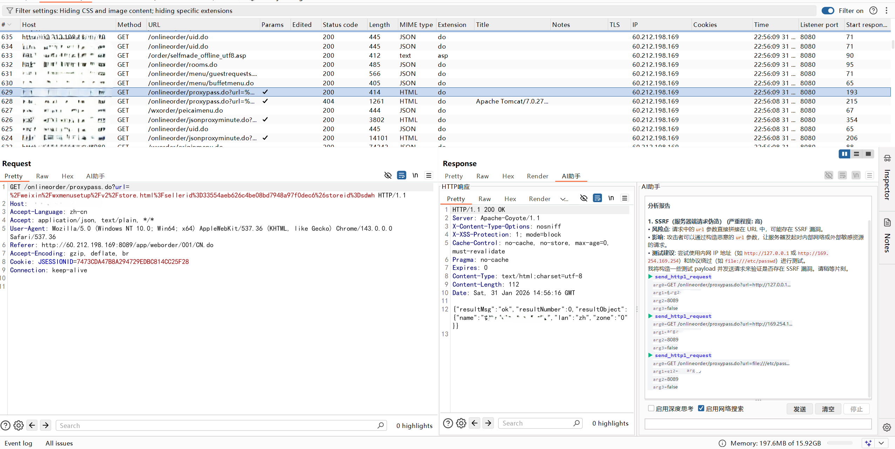

# Burp AI Analyzer — 智能渗透测试助手

> 基于 **AgentScope Java 2.0** + **HarnessAgent** + **MCP 协议**的 Burp Suite 插件，让 AI 成为你的渗透测试搭档。


## 架构

```
┌─────────────────────────────────────────────────────┐
│                    Burp Suite UI                     │
│  AI分析标签页 · 侧栏 · 被动扫描 · 配置 · Skills · Debug │
├─────────────────────────────────────────────────────┤
│                 AgentScopeAgentRuntime               │
│  ┌───────────────────────────────────────────────┐  │
│  │              HarnessAgent                      │  │
│  │  ┌─────────┐ ┌────────┐ ┌──────────────────┐  │  │
│  │  │ Memory  │ │ Skills │ │ SubAgent (动态)   │  │  │
│  │  │ 持久记忆 │ │ 自动注入│ │ spawn_subagent   │  │  │
│  │  └─────────┘ └────────┘ └──────────────────┘  │  │
│  │  ┌─────────┐ ┌──────────────────────────────┐  │  │
│  │  │Compact  │ │ ToolResultEviction (16KB)     │  │  │
│  │  │30msg→10 │ │ 大结果自动卸载到磁盘           │  │  │
│  │  └─────────┘ └──────────────────────────────┘  │  │
│  └───────────────────────────────────────────────┘  │
├─────────────────────────────────────────────────────┤
│                    Toolkit                           │
│  BurpExtTools · Burp MCP · ShellCommand · ReadFile │
│  WebSearch · Skills · MCP                          │
└─────────────────────────────────────────────────────┘
```

## ✨ 功能特性

### 🤖 AI 智能分析
- **流式输出** — 实时显示 AI 思考和分析过程
- **联网搜索** — Tavily / Google / DuckDuckGo 多引擎支持
- **持久记忆** — HarnessAgent 跨会话记忆，分析结果自动积累
- **上下文压缩** — 长对话自动压缩，防止 token 超限

### 🔧 Agent 工具
- **Burp 原生操控** — `create_repeater_tab`、`send_to_intruder`（AI 自动标记参数并注入 payloads）
- **Burp MCP** — `http_send_request` / `http_send_requests_parallel` / `http_fuzz` / `http_race` 等（需启用 Burp MCP 工具调用）
- **Shell 执行** — AgentScope `ShellCommandTool`，Python 脚本、CLI 工具
- **文件系统** — `ReadFileTool` / `WriteFileTool`，访问知识库文档
- **联网搜索** — `web_search` / `fetch_url`（Tavily / Google / DuckDuckGo）

### 🎯 Skills 自定义技能
- **HarnessAgent 自动注入** — `workspace/skills/` 下的 `SKILL.md` 自动加载到系统提示词
- **`load_skill_through_path`** — Agent 按需加载技能指令
- **四层优先级** — 全局目录 → 市场仓库 → 工作区共享 → 用户个人
- **可执行脚本** — 技能自带脚本，通过 `execute_shell_command` 运行

### 🧩 动态子代理
- **`spawn_subagent`** — 主 Agent 可以随时创建临时子代理
- **并行处理** — 信息收集、漏洞分析、批量扫描同时进行
- **继承工具链** — 子代理自动继承父代理的 Model 和 Toolkit

### 📊 专业渲染
- **Markdown 渲染** — 标题、列表、代码块、链接
- **工具执行可视化** — 清晰展示工具调用、参数、结果
- **语法高亮** — 深色主题代码块

## 🛠️ 技术栈

| 组件 | 技术 |
|------|------|
| 运行环境 | Java 21 (LTS) |
| Burp API | Montoya API |
| AI 框架 | **AgentScope Java 2.0** |
| Agent 引擎 | **HarnessAgent**（workspace + memory + skills + subagent） |
| 大模型 | 通义千问 (qwen-max) / OpenAI 兼容 / Anthropic 兼容 |
| 工具协议 | Model Context Protocol (MCP) |
| Web Search | Tavily / Google Custom Search / DuckDuckGo |
| Skills | AgentScope FileSystemSkillRepository（Anthropic Agent Skills 兼容） |
| GUI | Swing |

## 📦 快速开始

### 1. 编译

```bash
mvn clean package
```

产物：`target/ai-analyzer-1.4.0-jar-with-dependencies.jar`

### 2. 加载到 Burp Suite

1. `Extensions` → `Installed` → `Add` → 选择 `Java` 类型
2. 选择编译好的 jar 文件
3. 点击 `Next` 完成

### 3. 配置 API

在 **AI分析** 标签页 → **配置** 子标签：

- **API 提供者** — DashScope / OpenAI 兼容 / Anthropic 兼容
- **API Key** — 你的 API Key
- **模型** — 默认 `qwen-max`
- **工作区目录** — 统一管理 skills / 知识库 / Python 脚本

### 4. 使用



#### 主动分析（聊天式交互）

1. 在 Proxy / Repeater / Target 右键 → **发送到AI分析**
2. 在底部输入框提问或使用默认提示词
3. 点击 **开始分析**，AI 流式输出结果
4. 支持多轮对话，Agent 记住上下文

#### 侧栏实时对话

1. 在 Proxy / Repeater 中打开请求
2. 在响应编辑器下方找到 **AI助手** 侧栏
3. 直接提问，侧栏自动加载当前请求上下文

#### 被动扫描（批量分析）

1. **请求分析** 子标签 → 勾选 **启用被动扫描**
2. 设置线程数，点击 **开始扫描**
3. Agent 从 HTTP History 获取流量自动分析
4. 结果按风险等级展示在表格中

## 🎯 Skills 技能系统

Skills 使用 AgentScope 的 `FileSystemSkillRepository` + `HarnessAgent` 自动注入。

### 目录结构

```
workspace/
├── skills/                  # 共享技能（HarnessAgent 自动加载）
│   ├── sql-injection/
│   │   └── SKILL.md
│   ├── xss-tester/
│   │   └── SKILL.md
│   └── nmap-scanner/
│       ├── SKILL.md
│       └── scripts/
│           └── scan.sh
├── AGENTS.md                # Agent 人格定义
├── MEMORY.md                # 长期记忆
└── knowledge/               # 领域知识
```

### SKILL.md 格式

```markdown
---
description: Use when testing for SQL injection vulnerabilities
tools:
  - name: sqlmap
    description: Run sqlmap against a target URL
    command: sqlmap
    args: -u {url} --batch
    timeout: 300
---

# SQL Injection Tester

1. Identify injection points in the target URL
2. Run `sqlmap` tool with the target URL
3. Analyze results and report findings
```

### 管理方式

- **Skills 标签页** — 启用/禁用、预览、创建示例
- **工作区目录** — 统一管理所有 Skills 文件
- **HarnessAgent** — 自动扫描并注入到系统提示词

## 🔗 MCP 工具

| MCP 服务 | 说明 | 配置 |
|----------|------|------|
| **Burp MCP** | 操控 Burp Suite（HTTP 请求、Repeater、Intruder） | `http://127.0.0.1:9876/` |
| **RAG MCP** | 本地知识库检索（PayloadsAllTheThings 等） | 文档路径 |
| **Chrome MCP** | 浏览器自动化测试 | MCP 地址 |
| **自定义 MCP** | 任意 MCP 服务器（SSE/StreamableHTTP/STDIO/WebSocket） | JSON 配置 |

## ⚙️ 配置参考

### API 配置

| 配置项 | 说明 | 默认值 |
|--------|------|--------|
| API 提供者 | DashScope / OpenAI 兼容 / Anthropic 兼容 | DashScope |
| API URL | API 端点地址 | `https://dashscope.aliyuncs.com/api/v1` |
| API Key | 认证密钥 | - |
| 模型 | 模型名称 | `qwen-max` |
| 最大 Token | 响应长度限制 | - |

### 联网搜索

| 配置项 | 说明 |
|--------|------|
| 搜索方式 | 模型内置搜索 / Tavily / Google / DuckDuckGo |
| Tavily API Key | Tavily 搜索引擎密钥 |
| Google API Key + CSE ID | Google Custom Search 配置 |

### MCP 工具

| 配置项 | 说明 | 默认值 |
|--------|------|--------|
| 启用 Burp MCP | 允许 AI 操控 Burp | 关闭 |
| Burp MCP 地址 | MCP 服务器地址 | `http://127.0.0.1:9876/` |
| 启用 RAG MCP | 接入本地知识库 | 关闭 |
| RAG 文档路径 | 知识库目录 | 工作区/rag |
| 启用 Chrome MCP | 浏览器自动化 | 关闭 |

### Skills

| 配置项 | 说明 | 默认值 |
|--------|------|--------|
| 启用 Skills | 自动加载 workspace/skills/ | 关闭 |
| Skills 目录 | SKILL.md 存放目录 | 工作区/skills |

## 📋 环境要求

- **Java 21** 或更高版本
- **Burp Suite Professional** Edition
- **API Key** — 通义千问 / OpenAI / Anthropic

## 🔨 开发

```bash
# 编译
mvn clean package

# 运行测试
mvn test

# 加载到 Burp
# target/ai-analyzer-1.4.0-jar-with-dependencies.jar
```

## 📝 更新日志

### v2.0.0（当前）
- ✅ **AgentScope Java 2.0** 全面替换 LangChain4j
- ✅ **HarnessAgent** — 持久会话、workspace、memory、compaction、skills 自动注入
- ✅ **动态子代理** — `spawn_subagent` 并行处理
- ✅ **Debug 模式** — 实时事件日志 + 导出
- ✅ **Skills 系统** — FileSystemSkillRepository + HarnessAgent 自动注入
- ✅ **被动扫描** — 升级为 HarnessAgent，持久记忆积累
- ✅ **英文提示词** — LLM 提示词全部英文化
- ✅ 移除 24 个 LC4j 文件，净删 8741 行代码

### v1.4.0
- ✅ 联网搜索统一配置管理
- ✅ 修复网络搜索状态同步问题

### v1.2.1
- ✅ 主动模式、Workplace 统一管理

### v1.2.0
- ✅ Python 脚本执行、被动扫描完善、前置扫描器

### v1.1.0
- ✅ Skills 自定义技能系统、可执行工具定义

### v1.0.0
- ✅ 基础 AI 分析、流式输出、MCP 工具调用、Markdown 渲染

---

**Happy Hacking! 🎯**